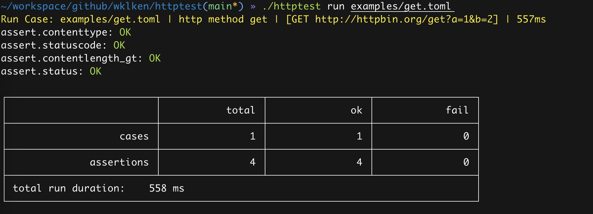

# httptest

A command line http test tool. Maintain the cases via git and pure text

After create the data in backend, we want to test the api via http request and assert the response, the postman & newman is easy for do this.

But when you get more than maybe 50+ cases, the exported json share in your teams, is huge, maybe more than 10000 lines, it's hard to maintain in the future.

So, why not make this simpler?

- all in text(.toml/.yaml/.json)
- easy to create/modify/copy and delete
- maintained by git
- run fast

**note: not ready for production**

(BTW: I have a 10-month-old baby to take care of, so, only a few hours a week on this project)

## screenshots





## features

- define the case via [toml](https://toml.io/en/), yaml/json also supported
- support http methods: get/post/put/delete/patch/head/options
- assert status/statusCode/contentLength/contentType/body
- assert latency
- assert numberic support `_in/_lt/_lte/_gt/_gte`
- assert string support `_contains/_not_contains/_startswith/_endswith`
- assert response json body, the path syntax is [jmespath](https://jmespath.org/tutorial.html)
- show run result with stats
- exit code != 0 if got any fail assertions

## examples

simplest

```
[request]
method = "get"
url = "http://httpbin.org/get"

[assert]
status = "OK"
statusCode = 200
```

full normal assertions

```toml
[request]
method = "get"
url = "http://httpbin.org/get"
[request.header]
hello = "world"

[assert]
status = "ok"
statusCode = 200
statusCode_in = [400, 500]
statusCode_lt = 100
statusCode_lte = 100
statusCode_gt = 500
statusCode_gte = 500
contentLength = 18
contentLength_lt = 1
contentLength_lte = 1
contentLength_gt = 180
contentLength_gte = 180
body = "HTTPBIN is awesome"
body_contains = "awesome2"
body_not_contains = "awesome"
body_startswith = "A"
body_endswith = "a"
contentType = "abc"
latency_lt = 0
latency_lte = 0
latency_gt = 100
latency_gte = 100
```

json assertions

```toml
[request]
method = "post"
url = "http://httpbin.org/post"
body = """
{
    "hello": "world",
    "array": [1, 2, 3, 4]
}
"""
[request.header]
Content-Type = "application/json"


[assert]
status = "ok"
statusCode = 200
contentLength_gt = 180
contentType = "application/json"

[[assert.json]]
path = "headers.Host"
value =  "httpbin.org"

[[assert.json]]
# path = "headers.\"Accept-Encoding\""
path = 'headers."Accept-Encoding"'
value =  "gzip"

[[assert.json]]
path = 'json.array[0]'
value =  1

[[assert.json]]
path = 'json.hello'
value =  "world"

[[assert.json]]
path = '*.hello'
value =  ["world"]

[[assert.json]]
path = "length(json.array)"
value = 4
```


## assertions

```toml
# status
status = "ok"
statusCode = 200
statusCode_in = [400, 500]
statusCode_lt = 100
statusCode_lte = 100
statusCode_gt = 500
statusCode_gte = 500

# content-length
contentLength = 18
contentLength_lt = 1
contentLength_lte = 1
contentLength_gt = 180
contentLength_gte = 180

# body
body = "HTTPBIN is awesome"
body_contains = "awesome2"
body_not_contains = "awesome"
body_startswith = "A"
body_endswith = "a"
```

## dependency

- [default config file: toml](https://toml.io/en/)
- [examples send request to httpbin](http://httpbin.org/)
- [json assertions via jmespath](https://jmespath.org/tutorial.html)

## TODO

- [ ] support string `_not_startswith/_not_endswith`
- [ ] supoort status_in/contentType_in
- [ ] `-e env.toml`, env vars and render everywhere
- [ ] set timeout each case or in global
- [ ] support trigger: stop run the case if fail, or continue
- [ ] HTTPTEST_DEBUG, via env, or env.toml; or `-v` verbose
- [ ] support `-h`
- [ ] support request body type, json/form/msgpack/zip.....
- [ ] sub-command: `bootstrap` create the raw template, like `example.toml.tpl`
- [ ] sub-command: `generate x` generate a case, from tpl
- [ ] how to run in order
- [ ] how to run in parallel
- [ ] multiple cases in one file, like ginkgo?
- [ ] how to test: long-live / file download / static file / websocket / keep-alive
- [ ] feature: retry
- [ ] feature: repeat
- [ ] assert redirect
- [ ] work with cookies, how to share between cases?
- [ ] error: dns / connection reset/timeout and so on
- [ ] feature: ssl / https
- [ ] display: file / line number to show which case fail
- [ ] feature: data share between cases

## inspired by

- testify/assert https://github.com/stretchr/testify/tree/master/assert (use this module, and copied some un-exported codes from it, follow the license)
- postman & newman https://www.npmjs.com/package/newman
