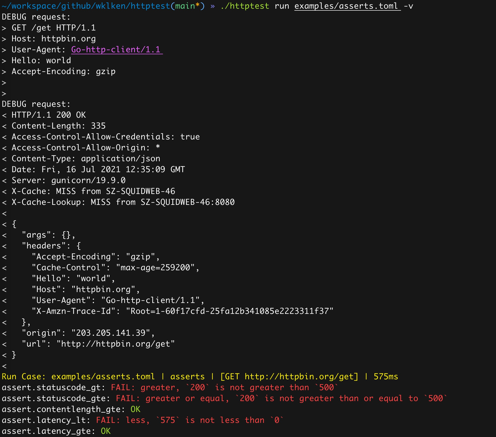

# httptest

> A command line http test tool
> Maintain the cases via git and pure text

We want to test the APIs via http requests and assert the responses, postman & newman are easy for this.

But when you got more than maybe 50+ cases, the exported json file shared with your team is huge, maybe more than 10000 lines, it's hard to maintain in the future.

So, here is the httptest

- all in text(.toml/.yaml/.json)
- easy to create/modify/copy and delete
- maintained by git
- run fast

**note: not ready for production**

## screenshots





## features

define:
- define the case via [toml](https://toml.io/en/) / yaml / json / properties / ini
- support http methods: get/post/put/delete/patch/head/options
- support post form, [examples/form.toml](./examples/form.toml)
- sent request body via external file `body = "@./post_body_file"` [examples/post_with_body_file.toml](./examples/post_with_body_file.toml)
- support [go template](https://golang.org/pkg/text/template/) render in all string value, the envs in config file, example: `./httptest run examples/use_template.toml -c examples/config/dev.toml -v`
- support send cookie [examples/cookies.toml](./examples/cookies.toml)
- suuport basic auth [examples/basic_auth.toml](./examples/basic_auth.toml)
- support share cookie [examples/share_cookies_save.toml](./examples/share_cookies_save.toml) and [examples/share_cookies_use.toml](./examples/share_cookies_use.toml)

assert:
- assert status/statusCode/contentLength/contentType/body
- assert latency
- assert numberic support `_in/_not_in/_lt/_lte/_gt/_gte`
- assert string support `_contains/_not_contains/_startswith/_endswith`
- assert response json body, the path syntax is [jmespath](https://jmespath.org/tutorial.html) [examples/json.toml](./examples/json.toml)
- assert response headers [examples/header.toml](./examples/header.toml)

cli:
- `exit code != 0` if got any fail assertions
- verbose mode: `./httptest run -v examples/get.toml` or `export HTTPTEST_DEBUG = true`
- quiet mode: `-q/--quiet` to silent the print, for check `$?` only
- show run result with stats
- configfile: `./httptest run -c examples/config/dev.toml examples/get.toml`

## examples

simplest

```toml
[request]
method = "get"
url = "http://httpbin.org/get"

[assert]
status = "OK"
statusCode = 200
```

full normal assertions: [asserts.toml](./examples/asserts.toml) / [asserts.json](./examples/asserts.json) / [asserts.yaml](./examples/asserts.yaml) | [assert.prop](./examples/asserts.prop) | [assert.ini](./examples/asserts.ini)

```toml
[request]
method = "get"
url = "http://httpbin.org/get"
[request.header]
hello = "world"

[assert]
# status
status = "ok"
statusCode = 200
statusCode_in = [400, 500]
statusCode_not_in = [200, 400]
statusCode_lt = 100
statusCode_lte = 100
statusCode_gt = 500
statusCode_gte = 500

# content-length
contentLength = 18
contentLength_lt = 1
contentLength_lte = 1
contentLength_gt = 180
contentLength_gte = 180

# content-type
contentType = "abc"

# body
body = "HTTPBIN is awesome"
body_contains = "awesome2"
body_not_contains = "awesome"
body_startswith = "A"
body_endswith = "a"
body_not_startswith = "{"
body_not_endswith = "}"

# latency
latency_lt = 0
latency_lte = 0
latency_gt = 100
latency_gte = 100
```

json assertions

```toml
[request]
method = "post"
url = "http://httpbin.org/post"
body = """
{
    "hello": "world",
    "array": [1, 2, 3, 4]
}
"""
[request.header]
Content-Type = "application/json"


[assert]
status = "ok"
statusCode = 200
contentLength_gt = 180
contentType = "application/json"

[[assert.json]]
path = "headers.Host"
value =  "httpbin.org"

[[assert.json]]
# path = "headers.\"Accept-Encoding\""
path = 'headers."Accept-Encoding"'
value =  "gzip"

[[assert.json]]
path = 'json.array[0]'
value =  1

[[assert.json]]
path = 'json.hello'
value =  "world"

[[assert.json]]
path = '*.hello'
value =  ["world"]

[[assert.json]]
path = "length(json.array)"
value = 4
```

with template render, `./httptest run examples/use_template.toml -c examples/config/dev.toml -v`

```toml
title = "http method post, use template"
description = "http method post"

[request]
method = "post"
url = "{{.host}}/post"
body = """
{
    "hello": "{{.name}}",
    "world": {{if .debug}}"in debug mode"{{else}}"not debug mode"{{end}},
    "array": "{{range $i, $a := .array}} {{$i}}{{$a}} {{end}}"
}
"""
[request.header]
Content-Type = "{{.content_type}}"


[assert]
status = "ok"
statusCode = 200
contentLength_gt = 180
contentType = "{{.content_type}}"
```

## dependency

- [default config file: toml](https://toml.io/en/)
- [examples send request to httpbin](http://httpbin.org/)
- [json assertions via jmespath](https://jmespath.org/tutorial.html)

## TODO

- [ ] support request body type, msgpack/zip.....
- [ ] assert redirect
- [ ] supoort status_in/contentType_in
- [ ] truncate the huge string, keep the begin and end
- [ ] feature: ssl / https
- [ ] sub-command: `bootstrap` create the raw template, like `example.toml.tpl`
- [ ] sub-command: `generate x` generate a case, from tpl
- [ ] support trigger: stop run the case if fail, or continue
- [ ] error: dns / connection reset/timeout and so on
- [ ] feature: data share between cases
- [ ] how to run in order
- [ ] how to run in parallel
- [ ] set timeout each case or in global
- [ ] multiple cases in one file, like ginkgo?
- [ ] feature: retry
- [ ] feature: repeat
- [ ] how to test: long-live / file download / static file / websocket / keep-alive
- [ ] case scope config, render=true, priority higher than global config
- [ ] display: file / line number to show which case fail

## inspired by

- testify/assert https://github.com/stretchr/testify/tree/master/assert (use this module, and copied some un-exported codes from it, follow the license)
- postman & newman https://www.npmjs.com/package/newman
